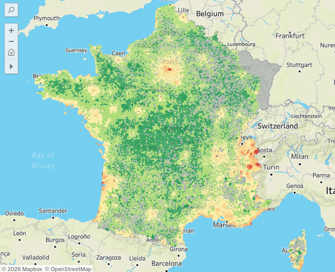
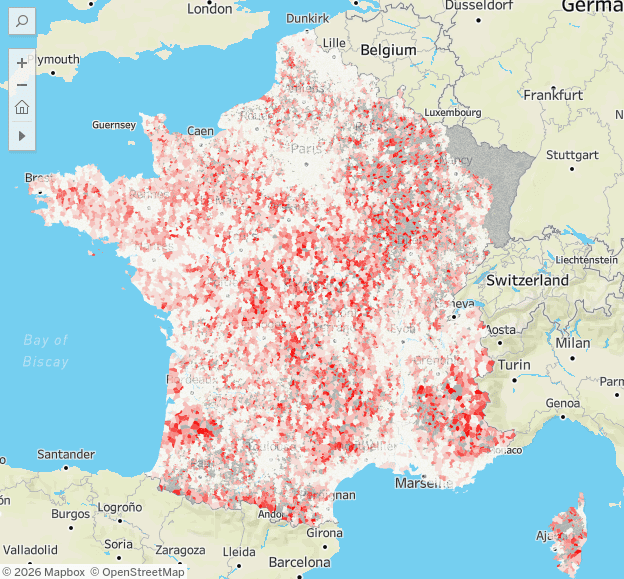

<div align="center">

# Real Estate vs. Essential Services Analysis

<table>
  <tr>
    <td></td>
    <td></td>
  </tr>
</table>

**[📊 View Interactive Dashboard on Tableau Public](https://public.tableau.com/app/profile/nino.lalanne.tisn./viz/shared/7PD78HN26)**

---

</div>

## Overview

Data pipeline merging **3.2M+ real estate transactions** with **public facilities census** to analyze correlations between property prices and service accessibility across 35,000 French municipalities.

**Key Question:** Does price per m² reflect access to essential services, or is it driven by geographic prestige?

### Technical Highlights

- **Processing 4GB+ datasets** using Polars lazy evaluation and streaming
- **Geodesic distance matrix calculation** (35k × 35k) vectorized with NumPy
- **Statistical normalization** (z-scores) for cross-municipality comparison
- **Multi-year trend analysis** (2021-2024) with outlier filtering
- **Outputs cleaned dataset** ready for Tableau visualization

### Data Sources

- **DVF (Real Estate Transactions)**: 3.2M records from French tax authority (DGFIP)
- **BPE (Facilities Census)**: INSEE official census of 10 essential services
- **Communes Database**: GPS coordinates for 35,000 municipalities

## Technical Stack

**Modern Python data engineering tools chosen for performance at scale:**

- **🐻‍❄️  Polars**: Lazy evaluation + streaming for memory-efficient processing of multi-GB datasets
- **📝 Marimo**: Reactive notebooks with built-in data lineage tracking
- **⚡ uv**: Fast dependency resolution (10-100x faster than pip)
- **🚨 Ruff**: Linting + formatting (10-100x faster than Black/Flake8)

## Quickstart

```bash
# Install dependencies
uv sync

# Run pipeline (downloads data automatically)
uv run marimo edit notebooks/pipeline.py

# Validate code quality
uv run ruff check . && uv run marimo check notebooks/*.py
```

**Output:** `data/final_dataset.csv` ready for Tableau import

## Project Structure

```
tableau-storytelling/
├── notebooks/pipeline.py      # Main ETL workflow (Marimo reactive notebook)
├── src/utils.py              # Geodesic calculations, data download utilities
├── data/                     # Auto-downloaded datasets (gitignored)
│   ├── dvf.csv              # Real estate transactions (3.2M rows, 4GB)
│   ├── bpe/                 # Facilities census
│   └── final_dataset.csv    # Pipeline output (~10k rows, <1MB)
└── pyproject.toml           # uv dependency lockfile
```

## Development Notes

- **English-only codebase** (functions, variables, docstrings) for international collaboration
- **Strong typing** (Python 3.12+ type hints) for maintainability
- **Lazy evaluation patterns** documented inline for learning Polars idioms
- **Reproducible**: Data auto-downloads from official sources on first run

## Data Sources & Licensing

- [DVF Dataset](https://www.data.gouv.fr/datasets/demandes-de-valeurs-foncieres-geolocalisees) (DGFIP, Open License)
- [BPE Dataset](https://www.insee.fr/fr/statistiques/8217527) (INSEE, Open License)  
- [Communes Database](https://www.data.gouv.fr/datasets/communes-et-villes-de-france) (Data.gouv, Open License)

*Note: Alsace-Moselle excluded from DVF (different cadastral system)*
